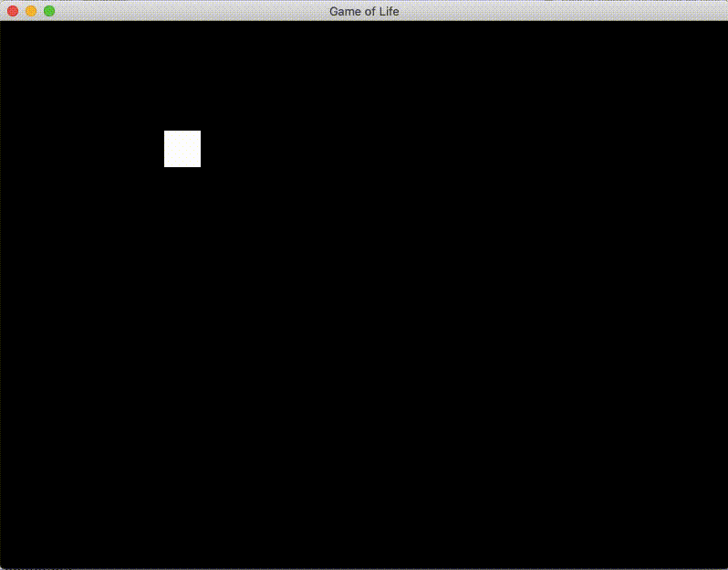
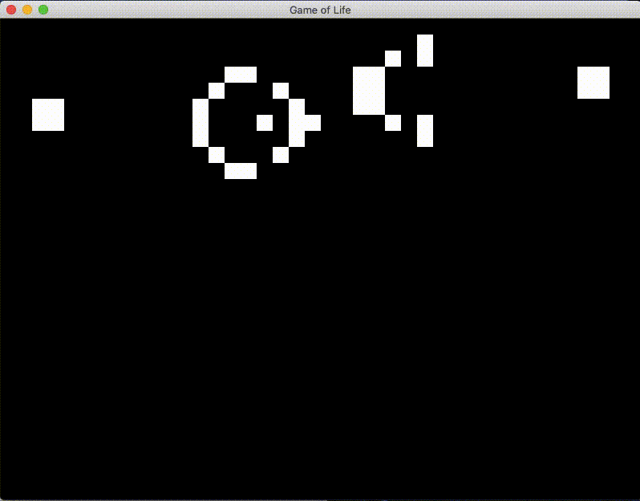
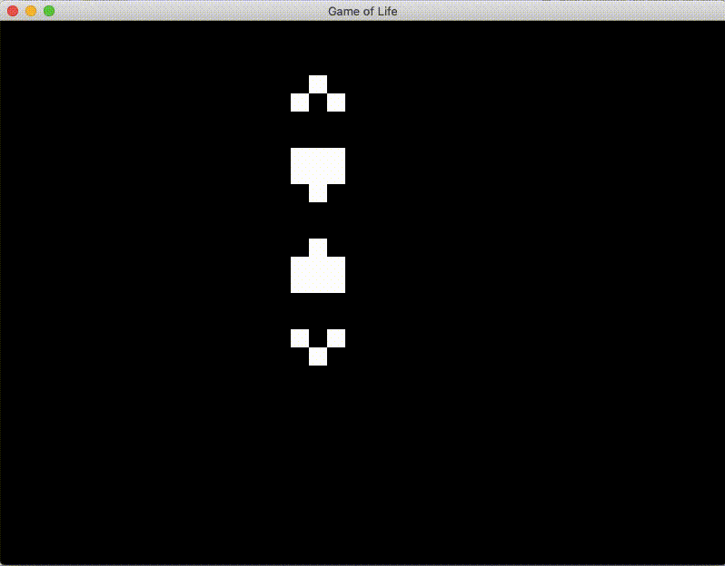

# Game of Life

This is an implementation of Conway's Game of Life made using C++ and SFML.

## Instructions

By default dead cells are colored black and live cells are colored white.

Right now there are only three controls which you can find listed below:

1. Left Click - place/remove cell, clicking a dead cell will make it a live cell and vice versa
2. R - clears all live cells off of the grid
3. Space - start/stop the screen

## Game Rules

These are the game rules that I used:

1. Live cells stay alive if two or three neighbors are alive, otherwise they will die.
2. Dead cells become alive if three neighbors are alive, otherwise they stay dead.

## Installation

You can follow these steps to install:

Setup vcpkg:

```text
git clone https://github.com/Microsoft/vcpkg.git
cd vcpkg
./bootstrap-vcpkg.sh
./vcpkg install sfml
./vcpkg integrate install
```

Build with CMake (make sure to update your toolchain file):

```text
git clone 
cd GameOfLife
mkdir build
cmake -B build/ -S . -DCMAKE_TOOLCHAIN_FILE=PUT PATH TO : vcpkg.cmake
cd build
cmake --build .
./GameOfLife
```

## Some examples

These are some examples of some common patterns in the Game of Life:

1. Block 
2. Glider 
3. Gosper glider gun 
4. Penta-decathlon 
